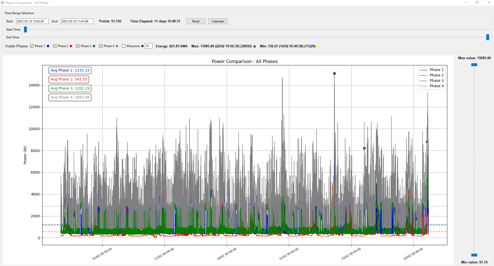

# Power Monitor - Visualisation de Données de Phases

Ce programme Python, nommé `Power Monitor`, est une application graphique permettant de visualiser et d'analyser des données de phases issues de fichiers CSV ou TXT, typiquement des données de voltage, courant et puissance.

## Fonctionnalités

*   **Chargement de Fichiers de Données :**
    *   Supporte les fichiers au format CSV et TXT.
    *   Utilise le séparateur `;` pour lire les données.

*   **Visualisation des Phases :**
    *   Crée des fenêtres individuelles pour chaque phase (jusqu'à la phase 3).
    *   Affichage des courbes de voltage, courant et puissance en fonction du temps.
    *   Calcul et affichage des valeurs moyennes du voltage, courant et puissance pour chaque phase.
    *   Calcul et affichage de l'énergie consommée par chaque phase (en kWh).
    *   Affichage dynamique du nombre de points affichés et du temps écoulé.
    *   Affiche les Min et Max avec le moment où ils sont apparus

*   **Fenêtres de Comparaison :**
    *   Permet de comparer les données de toutes les phases, ainsi que la moyenne de tension, la somme des intensités et des puissnaces des 3 phases, dans une seule fenêtre.
    *   Comparaison possible pour la tension, le courant et la puissance.
    *   Filtrage des données par valeur grâce à des sliders verticaux pour les valeurs min et max.
    *   Affichage dynamique du nombre de points affichés et du temps écoulé.
    *   Affichage de moyennes glissante avec la possibilité de choisir le nombre de point (valeur par défaut 10)
    *   Affiche les Min et Max avec et l'instant où ils sont apparus

*   **Contrôle Temporel :**
    *   Sliders horizontaux pour définir la plage temporelle à afficher.
    *   Possibilité de saisir manuellement les dates et heures de début et de fin.
    *   Bouton "Reset" pour afficher l'ensemble des données disponibles.
    *   Ajout d'un calendrier pour sélectionner la jour de l'analyse (00:00:00 à 23:59:59).

*   **Interface Utilisateur Graphique (GUI) :**
    *   Interface intuitive basée sur Tkinter.
    *   Cases à cocher pour sélectionner les phases et les types de comparaisons à afficher.
    *   Barre de menus avec options d'ouverture de fichier, de sortie et d'aide.
    *   Gestion des erreurs avec affichage des messages d'erreur dans une zone dédiée.

*   **Versionning :**
    *   Affichage du numéro de version et de l'auteur.
    *   Menu "About" présentant l'historique des mises à jour.

## Installation

1.  Assurez-vous d'avoir Python 3 installé sur votre système.
2.  Installez les bibliothèques nécessaires en utilisant `pip` :

    ```bash
    pip install pandas matplotlib Pillow
    ```

## Utilisation

1.  Lancez le script `datas_phases.py`.
2.  Cliquez sur le bouton "Load File" pour charger un fichier CSV ou TXT contenant les données.
3.  Sélectionnez les phases à afficher et les types de comparaisons souhaitées en cochant les cases correspondantes.
4.  Ajustez la plage temporelle à l'aide des sliders.
5.  Utilisez les sliders verticaux pour filtrer les données par valeur (uniquement pour les fenêtres de comparaison).
6.  Les fenêtres correspondantes s'ouvriront, affichant les graphiques et les informations pertinentes.

## Capture d'écran




## Notes

*   Le programme est conçu pour fonctionner avec des données structurées de manière spécifique. Assurez-vous que votre fichier de données respecte le format attendu (séparateur `;`, colonnes pour le temps UNIX, le date/time,, le voltage, le courant et la puissance de chaque phase, la moyenne et les sommes des intensités et des puissances
*   La performance du programme peut être affectée par la taille du fichier de données. Des fichiers très volumineux peuvent entraîner des temps de chargement et de traitement plus longs.

A noter la possibilité de transformer le script en executable sous windows. Compiler le fichier.py avec la ligne de commande

  ```bash
    my```

## Auteur

Michel ESPARSA

## Version

2.2 du 08/03/2025
